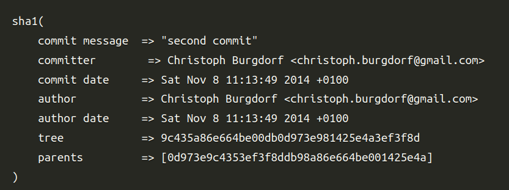
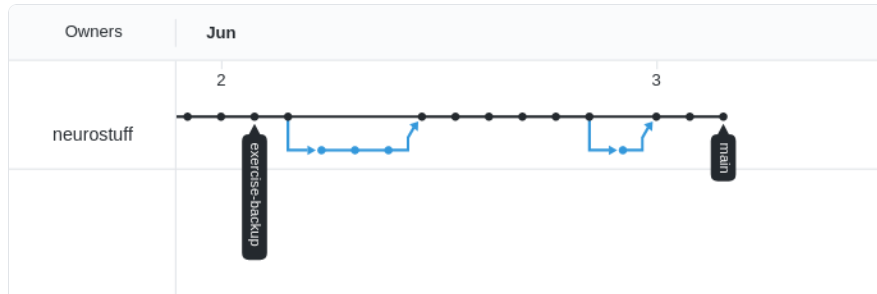
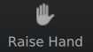

---
jupyter:
  jupytext:
    encoding: '# -*- coding: utf-8 -*-'
    formats: ipynb,md
    text_representation:
      extension: .md
      format_name: markdown
      format_version: '1.3'
      jupytext_version: 1.11.2
  kernelspec:
    display_name: Python 3
    language: python
    name: python3
---

<!-- #region slideshow={"slide_type": "skip"} -->

<!-- #endregion -->


<!-- #region slideshow={"slide_type": "subslide"} -->
# Introduction to Git and GitHub

**For the SSC workshop on "Best practices in computational reproducibility"**

Kendra Oudyk

2021-06-06

Much of this is borrowed from the [**"Version control with Git"**](https://swcarpentry.github.io/git-novice/) tutorial by Software Carpentries
<!-- #endregion -->

```python
print('hello')
```

<!-- #region slideshow={"slide_type": "slide"} -->
# Goals
1. **Explain why git/GitHub are useful**
2. Explain basically how git works
3. Track and share your work using git/GitHub
4. Contribute to a project using git/GitHub
<!-- #endregion -->

<!-- #region slideshow={"slide_type": "slide"} -->


“Piled Higher and Deeper” by Jorge Cham, http://www.phdcomics.com

*Note: we don't usually track .doc files with git*
<!-- #endregion -->

<!-- #region slideshow={"slide_type": "slide"} -->
# Automated version control
<!-- #endregion -->

<!-- #region slideshow={"slide_type": "subslide"} -->
### Record versions by tracking *changes*
It's like having an unlimited "undo" button

<!-- #endregion -->

<!-- #region slideshow={"slide_type": "subslide"} -->
### Make independent changes

<!-- #endregion -->

<!-- #region slideshow={"slide_type": "fragment"} -->
### And incorporate the changes


https://swcarpentry.github.io/git-novice/
<!-- #endregion -->

<!-- #region slideshow={"slide_type": "subslide"} -->
# Git vs GitHub

Git is the "language". It can be installed on any platform.

GitHub hosts git repositories in remote locations. 
<!-- #endregion -->

<!-- #region slideshow={"slide_type": "fragment"} -->
- GitHub is a company, the future of this company is unknown !  
- Other places specialized in hosting git repositories on the web:
  - Gitlab
  - Bitbucket
  - ...
<!-- #endregion -->

<!-- #region slideshow={"slide_type": "subslide"} -->
# Git & GitHub make your work more efficient

- Git was built because Linus Torwarld realized that merging the work of thousands of linux kernel contributors was getting impossible with other source control systems
<!-- #endregion -->

<!-- #region slideshow={"slide_type": "fragment"} -->
- Since then: it has been adopted very widely: there is a reason :)
<!-- #endregion -->

<!-- #region slideshow={"slide_type": "fragment"} -->
- Git is good for companies and large project: it is also for scientists

"Time is money"

<!-- #endregion -->

<!-- #region slideshow={"slide_type": "subslide"} -->
# Git & GitHub let you track your work
<!-- #endregion -->

<!-- #region slideshow={"slide_type": "fragment"} -->
# ... as well as info *about* your work

- what was the change
- who did it
- why
- when
<!-- #endregion -->

<!-- #region slideshow={"slide_type": "subslide"} -->


Chacon, S., & Straub, B. "Pro Git" https://git-scm.com/book/en/v2/Getting-Started-What-is-Git%3F
<!-- #endregion -->

<!-- #region slideshow={"slide_type": "subslide"} -->

<!-- #endregion -->

<!-- #region slideshow={"slide_type": "fragment"} -->

<!-- #endregion -->

<!-- #region slideshow={"slide_type": "subslide"} -->

<!-- #endregion -->

<!-- #region slideshow={"slide_type": "slide"} -->
# Git/GitHub can help you do Open Science
<!-- #endregion -->

<!-- #region slideshow={"slide_type": "fragment"} -->


(Credit to Christina Bergmann for the idea of the 'Open Science Buffet')
<!-- #endregion -->


<!-- #region slideshow={"slide_type": "slide"} -->
# Goals
1. Explain why git/GitHub are useful
2. **Explain basically how git works**
3. Track and share your work using git/GitHub
4. Contribute to a project using git/GitHub
<!-- #endregion -->

<!-- #region slideshow={"slide_type": "subslide"} -->
# What's a repository?

- all files & folders in the project
- each file's revision history
<!-- #endregion -->

<!-- #region slideshow={"slide_type": "fragment"} -->

<!-- #endregion -->

<!-- #region slideshow={"slide_type": "subslide"} -->
## What do we "track" with git ?

- Generally : small files
  - ascii files (unformatted text, incl. characters, numbers, punctionation, tabls, and carriage returns)

<!-- #endregion -->

<!-- #region slideshow={"slide_type": "fragment"} -->

- A repository is composed of a set of files and directories
- We know a directory (equivalently: folder) is a git repository because there is a ".git" folder in it
<!-- #endregion -->

<!-- #region slideshow={"slide_type": "slide"} -->
# What are branches?
<!-- #endregion -->

<!-- #region slideshow={"slide_type": "fragment"} -->

<!-- #endregion -->

<!-- #region slideshow={"slide_type": "subslide"} -->

<!-- #endregion -->

<!-- #region slideshow={"slide_type": "fragment"} -->
git was originally made for Linux development, which involves 1000's of contributers.
<!-- #endregion -->

<!-- #region slideshow={"slide_type": "slide"} -->
# Goals
1. Explain why git/GitHub are useful
2. Explain basically how git works
3. **Track and share your work using git/GitHub**
4. Contribute to a project using git/GitHub
<!-- #endregion -->

<!-- #region slideshow={"slide_type": "subslide"} -->
### Common workflow
# Track and share your work using git/GitHub
<!-- #endregion -->

<!-- #region slideshow={"slide_type": "subslide"} -->

<!-- #endregion -->

<!-- #region slideshow={"slide_type": "subslide"} -->
## Create a new directory
And change into the directory

`mkdir <directory name>`\
`cd <directory name>`

<!-- #endregion -->

<!-- #region slideshow={"slide_type": "fragment"} -->
## Make it into a git repository
`git init`

<!-- #endregion -->

<!-- #region slideshow={"slide_type": "subslide"} -->
## Make a change
e.g., create a file called 'README.md'


<!-- #endregion -->

<!-- #region slideshow={"slide_type": "fragment"} -->
## Check what git is aware of
`git status`


<!-- #endregion -->

<!-- #region slideshow={"slide_type": "subslide"} -->
## Add the file so git is aware of it
<!-- #endregion -->

<!-- #region slideshow={"slide_type": "fragment"} -->
Put it in the "staging area"

<!-- #endregion -->

<!-- #region slideshow={"slide_type": "fragment"} -->
`git add <filename>`

<!-- #endregion -->

<!-- #region slideshow={"slide_type": "subslide"} -->
## Take a snapshot of the staging area

<!-- #endregion -->

<!-- #region slideshow={"slide_type": "fragment"} -->
`git commit -m "<short, informative commit message>"`

<!-- #endregion -->

<!-- #region slideshow={"slide_type": "subslide"} -->
## What does all this *actually* look like?

Commits: what are they under the hood ? 

- Commits are "hashes". You take hashes of files, hashes of the directories, and then hash these hashes !

- See https://blog.thoughtram.io/git/2014/11/18/the-anatomy-of-a-git-commit.html for a great explanation of what is a "commit".

- In a nutshell, a commit contains the exact state of your "working tree" (the directory you are working in) of all the files tracked by Git. 
<!-- #endregion -->

<!-- #region slideshow={"slide_type": "subslide"} -->


Chacon, S., & Straub, B. "Pro Git" https://git-scm.com/book/en/v2/Getting-Started-What-is-Git%3F
<!-- #endregion -->

<!-- #region slideshow={"slide_type": "fragment"} -->

<!-- #endregion -->

<!-- #region slideshow={"slide_type": "subslide"} -->
### but, what is a "hash" like this sha1 function?

A hash will take *the content* of a file or some information as an entry, and return a number that is *unique* to this file or information

If anything changes in the file (even a single character), the hash will be different.
<!-- #endregion -->

<!-- #region slideshow={"slide_type": "fragment"} -->
### where are these in .git ?

in .git/objects !
<!-- #endregion -->

<!-- #region slideshow={"slide_type": "fragment"} -->
### see what's in a commit ?

`git show theuglycommitnumber-or-reference-eg-branch`
<!-- #endregion -->

<!-- #region slideshow={"slide_type": "subslide"} -->
## Create a corresponding GitHub repo for sharing your work


<!-- #endregion -->

<!-- #region slideshow={"slide_type": "subslide"} -->
## Tell git the address of your remote repository
`git remote add <remote name> <remote location>`

<!-- #endregion -->

<!-- #region slideshow={"slide_type": "fragment"} -->
## Rename principal branch from *master* to *main* (if needed)

<!-- #endregion -->

<!-- #region slideshow={"slide_type": "subslide"} -->
## while we are talking of branches ...

branches: what are they ? 

- So small, so simple ! branches are little ascii files, the name of the file is the branch name, the content is the commit hash !

and while we are here : what is a tag ?

- A tag is very much like a branch, but will always keep the same commit. It is another name for a commit !
<!-- #endregion -->

<!-- #region slideshow={"slide_type": "subslide"} -->
## Push changes to github
`git push <remote> <branch>`\
(the `-u` is needed only the first time) 


<!-- #endregion -->

<!-- #region slideshow={"slide_type": "slide"} -->
# Goals
1. Explain why git/GitHub are useful
2. Explain basically how git works
3. Track and share your work using git/GitHub
4. **Contribute to a project using git/GitHub**
<!-- #endregion -->

<!-- #region slideshow={"slide_type": "subslide"} -->
### Common workflow
# Contributing to a project using git/GitHub
<!-- #endregion -->

<!-- #region slideshow={"slide_type": "subslide"} -->

<!-- #endregion -->

<!-- #region slideshow={"slide_type": "subslide"} -->
## Open/find an issue to work on

<!-- #endregion -->

<!-- #region slideshow={"slide_type": "subslide"} -->
## (Wait for approval)
<!-- #endregion -->

<!-- #region slideshow={"slide_type": "subslide"} -->
## Fork the respository on GitHub
(If you haven't already)

<!-- #endregion -->

<!-- #region slideshow={"slide_type": "subslide"} -->
## Download the forked repository onto your machine
`git clone <remote's url>.git`

<!-- #endregion -->

<!-- #region slideshow={"slide_type": "fragment"} -->
## Or, if you already have it, pull any changes that your collaborators made
`git pull <remote> <branch>`

<!-- #endregion -->

<!-- #region slideshow={"slide_type": "subslide"} -->
## Prepare to make changes
Create a new branch on which store any new changes, and switch to that branch

`git checkout -b <yourBranch>` \
(`git branch <yourBranch>` + `git checkout <yourBranch>`)\
(you don't need the `-b` once the branch exists)


<!-- #endregion -->

<!-- #region slideshow={"slide_type": "subslide"} -->
## Make changes
<!-- #endregion -->

<!-- #region slideshow={"slide_type": "subslide"} -->
## See changes
`git status`

<!-- #endregion -->

<!-- #region slideshow={"slide_type": "fragment"} -->
`git diff`\
(*line by line*)

<!-- #endregion -->

<!-- #region slideshow={"slide_type": "subslide"} -->
## Stage changes
`git add <file1> <file2>`


<!-- #endregion -->

<!-- #region slideshow={"slide_type": "subslide"} -->
## Take the snapshot of the staging area
`git commit -m "<short, informative commit message>"`


<!-- #endregion -->

<!-- #region slideshow={"slide_type": "subslide"} -->
## Share your work
`git push <remote> <branch>`


<!-- #endregion -->

<!-- #region slideshow={"slide_type": "subslide"} -->
## Pull request
(ask collaborators to add your changes)

<!-- #endregion -->

<!-- #region slideshow={"slide_type": "subslide"} -->
## Let's see how the graph changed

<!-- #endregion -->

<!-- #region slideshow={"slide_type": "fragment"} -->
Then, when the pull request was merged..

<!-- #endregion -->

<!-- #region slideshow={"slide_type": "slide"} -->
# Goals
1. Explain why git/GitHub are useful
2. Explain basically how git works
3. Track and share your work using git/GitHub
4. Contribute to a project using git/GitHub

*We'll practice 3. and 4. at the end of this workshop*
<!-- #endregion -->

<!-- #region slideshow={"slide_type": "subslide"} -->
### Check your understanding

# Explain "Why would you use git?" to a new grad student

<!-- #endregion -->

<!-- #region slideshow={"slide_type": "subslide"} -->
### Check your understanding

# What does git track?
a) letter changes\
b) line changes\
c) document changes


<!-- #endregion -->

<!-- #region slideshow={"slide_type": "fragment"} -->

<!-- #endregion -->

<!-- #region slideshow={"slide_type": "subslide"} -->
### Check your understanding
# Put these commands in order
to form a basic workflow for tracking and sharing a change. 


`commit` &nbsp; &nbsp;
`push` &nbsp; &nbsp;
`add` &nbsp; &nbsp;

- make a change
- stage the change: `git ____ <filename>`
- commit the change: `git ____ -m "<commit message>"`
- put the change on GitHub: `git ____ origin main`


<!-- #endregion -->

<!-- #region slideshow={"slide_type": "slide"} -->
# Git is hard
Here are some tips
<!-- #endregion -->

<!-- #region slideshow={"slide_type": "subslide"} -->
# Git buffet


Take away what you can; come back for more when you're ready.
<!-- #endregion -->

<!-- #region slideshow={"slide_type": "subslide"} -->
## Sit down and go through a tutorial


<!-- #endregion -->

<!-- #region slideshow={"slide_type": "subslide"} -->
## Don't expect to remember everything

<!-- #endregion -->

<!-- #region slideshow={"slide_type": "subslide"} -->
## Keep common commands on a sticky note

<!-- #endregion -->
<!-- #region slideshow={"slide_type": "slide"} -->
# The End


Software Carpentry's tutorial: https://swcarpentry.github.io/git-novice/


<!-- #endregion -->

<!-- #region slideshow={"slide_type": "slide"} -->
# Introduction to Git and GitHub: Practical session

**For the SSC workshop on "Best practices in computational reproducibility"**

Kendra Oudyk

2021-06-06

Much of this is borrowed from the [**"Version control with Git"**](https://swcarpentry.github.io/git-novice/) tutorial by Software Carpentries
<!-- #endregion -->

<!-- #region slideshow={"slide_type": "slide"} -->
# Outline

- Setup
- Practice tracking and sharing your own work using git/GitHub
- Practice collaborating using git/GitHub
<!-- #endregion -->

<!-- #region slideshow={"slide_type": "slide"} -->
# Notes

- Replace <> with your own info
- Slashes in paths go the other way in Windows\
e.g., Linux and MacOS: `path/to/my-repo` vs Windows: `path\to\my-repo`
<!-- #endregion -->

<!-- #region slideshow={"slide_type": "slide"} -->
# Setup
### To follow on your machine, you'll need
1. Bash
2. Git
3. Text editor
4. GitHub account
<!-- #endregion -->

<!-- #region slideshow={"slide_type": "subslide"} -->
## Check if you're ready

1. Can you open a text editor? (e.g., Linux: gedit, nano. macOS: textedit. Windows: notepad)
2. Can you go your GitHub account?
3. When you open a Bash shell and type `git --version` and press ENTER, does it output the version number? 

#### Put any errors/problems in the Q&A so we can keep the answer with the question

<!-- #endregion -->

<!-- #region slideshow={"slide_type": "fragment"} -->
#### If you anwered 'yes' to all 3 questions, raise your hand

<!-- #endregion -->

<!-- #region slideshow={"slide_type": "subslide"} -->
## Configure git
```
git config --global user.name "<Vlad Dracula>"
git config --global user.email "<vlad@tran.sylvan.ia>"
```
*use the email you used for your GitHub account*  👆

#### macOS / Linux
```
git config --global core.autocrlf input
```

#### Windows
```
git config --global core.autocrlf true

```

### Put any errors in the Q&A

<!-- #endregion -->

<!-- #region slideshow={"slide_type": "slide"} -->
# Pairing up for the task practicing collaboration


Put your **GitHub username** in one of these columns
- **Less** experienced/confident using git/GitHub
- **More** experienced/confident using git/GitHub


https://docs.google.com/spreadsheets/d/18DoOFu0Qw7p2BQFK8QtHAnjiKgcR7JE6L0Ro54z4VQo/edit?usp=sharing


<!-- #endregion -->

<!-- #region slideshow={"slide_type": "slide"} -->
# Let's practice git/GitHub!

Repository with slides and tasks (in the "Issues" tab)
https://github.com/koudyk/intro_git_github
<!-- #endregion -->
